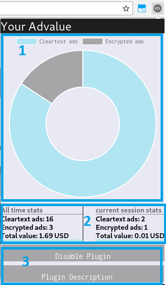

YourAdValue
---

YourAdValue computes the per ad-slot and overall price paid for you by the ad ecosystem in real time.

For more information: See our <a href="https://www.ics.forth.gr/_publications/imc17-panpap.pdf">paper</a>

## Downloads
Chrome: <a href="https://">Download</a>

Before Downloading please read and accept our <a hred="https://github.com/panpap/YourAdValue/blob/master/YourAdValue_EULA.pdf">EULA</a>

<h1>YourAdValue Extension</h1>
        <h3>1. Installation</h3>
        You can install the plugin in your Chrome browser by downloading the code from our Github repository (<a href=''> link to repository</a>), or by downloading it from the Chrome web Store <a href=''>link to the store</a>. Before installing the plugin, please study the <a href="YourAdValue_EULA.pdf">YourAdValue EULA</a> and be sure you understand and accept the terms and conditions.
         
        <h3>2. Open Extension Popup Window </h3>
        After you install the extension to your Chrome browser successfully, an icon will appear in the upper right corner of your browser (as demostrated in Figure 1). You can access the plugin by clicking this icon.  
        As you navigate through various websites, this icon will change color and turn into red. When the icon turns red, a number will appear next to it. This is the number of the advertisements that were detected by the YourAdValue plugin, and these are advertisements that utilize the Real Time Bidding (RTB) to be displayed (an example of such advertisment is shown in Figure 3).
        <figure>
            
            <figcaption>Figure 1. Icon after plugin installation </figcaption>
        </figure>
         
        <h3>3. Extension Statistics Description</h3>
                

            When clicking the plugin icon a popup window appears. The popup window is seperated in three main sections: 1) at the top there is a pie chart scetion, 2)below the pie chart there are some statistics and 3) at the bottom there are some options.  
        1) The pie chart displays the statistics about the number of advertisements caught during the lifetime of the plugin in the specific user's browser. The visual is in a user friendly and understandable fashion. Advertisements are divided in two categories: Encrypted and Cleartext. Encrypted are the ads that their value was sent in encrypted format, and Cleartext are the ads that their value was sent in an unencrypted (plaintext) format. 
         
        2) The statistics session displays the statistics about the ads detected. This section is divided in two subsections as well: the 'all time stats' and 'current session stats'.
        In the 'all time stats' section, the statistics shown are about advertisements delivered through the lifetime of the plugin on the user's browser. These statistics include the number of encrypted advertisements, the number of the cleartext advertisements and the total monetary value of the advertisements delivered and detected, in US dollars.
        In the 'current session stats'  the same statistics are displayed as before, but only for the period that the browser was open, until it was closed again.
         
        3) In the options section,the user is given the choice to disable the plugin, as well as to see the description page(this page). If the user disable the plugin, their choice is valid only until they close the browser.
                 <figure>
                    
                    <figcaption>Figure 2. The plugin's user interface </figcaption>
                 </figure>
             

        <h3>4. Advertisements Detection</h3>
        The extension is able to detect when a Real Time Bidding (RTB) advertisement is displayed as the user browses through websites. It also provides information about these ads in real time. In the following screenshot you can see the plugin in action (Figure 3). 
        Point number 1: When a page is rendered in the user's browser, the plugin will change color if RTB ads are detected. Next to the plugin icon, there will be a number signifying how many RTB ads are succefully detected by YourAdValue Extension. 
        Point number 2: This is an example of a Real Time Bidding Advertisement caught by YourAdValue extension.  
        <figure>
            
            <figcaption>Figure 3. The plugin in action.</figcaption>
        </figure>

## Bug Report
If you encountered any unexpected behaviour please report using this form: https://docs.google.com/forms/d/e/1FAIpQLScS42vjYmo-bIVJ9Sv04WOD-eykFWitjNn0sYUdHsO43LVhyA/viewform?usp=sf\_link
